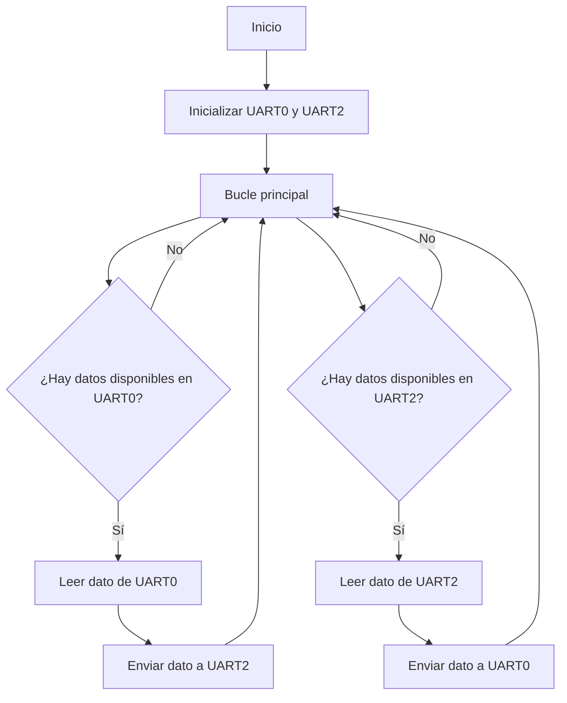
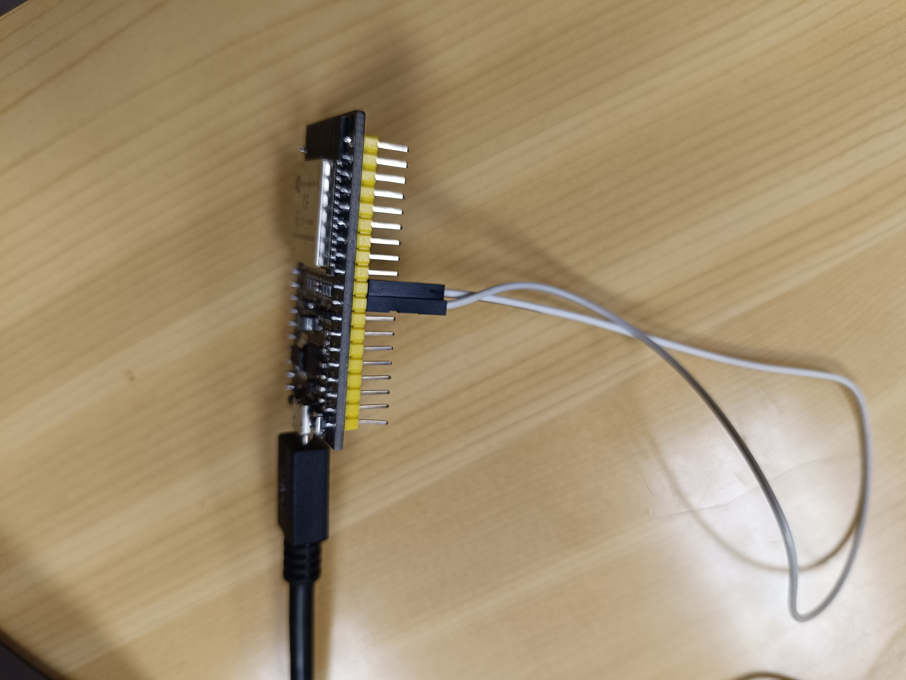

# P8. UART. Cruce entre un monitor y un teclado.
# Objetivo: 
-  Transmitir datos bidireccionalmente entre dos puertos seriales (UART0 y UART2).
## Materiales: 
- ESP32-S1
- Monitor ordenador
- Teclado ordenador
- Cable (para el cruce)
## Procedimiento: 
**Código:**
```cpp
    #include <Arduino.h>

    void setup() {
    Serial.begin(115200);   // Inicializar Serial (UART0)
    Serial2.begin(115200);  // Inicializar Serial2 (UART2)
    }

    void loop() {
    // Leer datos de la UART0 y enviarlos a la UART2
    if (Serial.available()) {
        char c = Serial.read();
        Serial2.write(c);
    }
    
    // Leer datos de la UART2 y enviarlos a la UART0
    if (Serial2.available()) {
        char c = Serial2.read();
        Serial.write(c);
    }
    }
```
**Descripción:**<br>
Establece comunicación bidireccional entre dos puertos seriales. Comienza con la función ``setup()``, se inicializan dos puertos seriales: UART0 y UART2, con una velocidad de transmisión de 115200 baudios.<br>
En la función ``loop()``, se implementa un bucle continuo que ejecutará las operaciones de lectura y escritura de datos entre los dos puertos seriales. Primero, se comprueba si hay datos disponibles en UART0 utilizando ``Serial.available()``. Si hay datos disponibles, se lee un carácter de UART0 con ``Serial.read()`` y se envía ese carácter a UART2 utilizando ``Serial2.write()``. Después, se repite el mismo procedimiento en forma de bucle.
### Diagrama de flujos: 

###  Salida por el puerto serie: 
Lo que tu escribas por el teclado se imprimirà en la consola, por ejemplo: 
```
    hola hola hola
```
### Foto del montaje: 
 <br>
## Conclusión:  
Permite la transferencia de datos en ambas direcciones entre dos puertos seriales. 